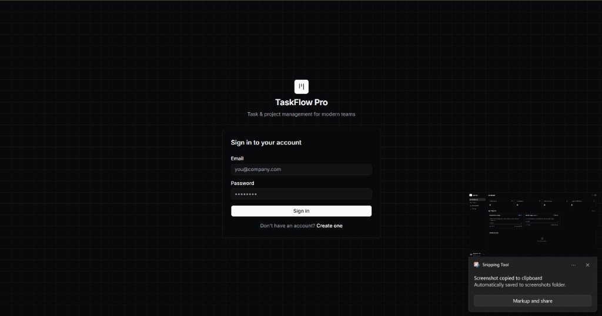
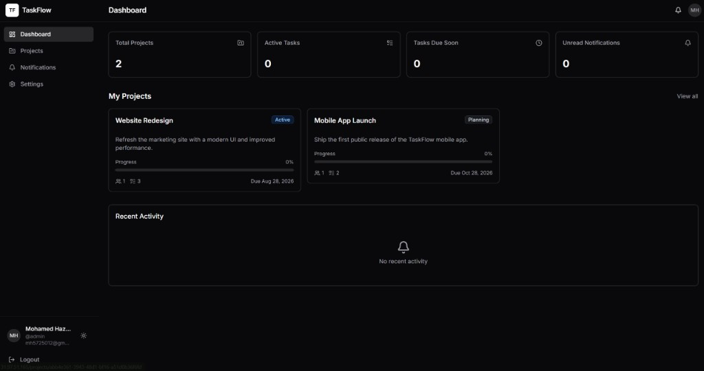

# TaskFlow Pro

> **Full-stack project & task management platform** for modern teams — Spring Boot API, Next.js dashboard, PostgreSQL, JWT auth, and real-time collaboration workflows.

[](https://openjdk.org/)
[](https://spring.io/projects/spring-boot)
[](https://nextjs.org/)
[](https://www.postgresql.org/)
[](https://www.docker.com/)
[](LICENSE)

---

## Overview

**TaskFlow Pro** is a production-oriented monorepo that pairs a **Spring Boot REST API** with a **Next.js web application**. Teams can create projects, manage tasks, assign work, track status and priority, collaborate through comments, and stay informed with in-app notifications.

The backend follows layered clean architecture with JWT security, role-based access control, Liquibase migrations, audit logging, and Testcontainers-backed integration tests. The frontend delivers a responsive dark-mode UI built with React Query, React Hook Form, and shadcn/ui.

---

## Screenshots

### Login



### Dashboard



---

## Features

| Area | Highlights |
|------|------------|
| **Authentication** | Register, login, JWT sessions, protected routes |
| **Projects** | CRUD, team membership, role-based permissions |
| **Tasks** | Status, priority, assignees, due dates, comments, history |
| **Notifications** | In-app alerts for assignments, status changes, and project invites |
| **Admin** | User management, role assignment, audit logs |
| **API Docs** | Interactive Swagger UI (OpenAPI 3) |

---

## Repository Structure

```
taskflow-pro/
├── backend/          # Spring Boot 3 REST API (Java 21)
├── frontend/         # Next.js web application
├── docker-compose.yml
└── README.md
```

---

## Tech Stack

### Backend (`backend/`)

- Java 21, Spring Boot 3.2, Spring Security (JWT)
- PostgreSQL 16, Spring Data JPA, Liquibase
- MapStruct, SpringDoc OpenAPI, Testcontainers

### Frontend (`frontend/`)

- Next.js 16, React 19, TypeScript
- Tailwind CSS 4, shadcn/ui, Radix UI
- TanStack Query, Axios, React Hook Form, Zod

---

## Prerequisites

- [Docker Desktop](https://www.docker.com/products/docker-desktop/) (recommended)
- [Node.js](https://nodejs.org/) 20+ (for local frontend dev)
- [Java 21](https://adoptium.net/) + Maven (optional, if running backend without Docker)

---

## Quick Start

### Run everything with Docker (recommended)

From the repository root:

```bash
docker compose up --build
```

| Service | URL |
|---------|-----|
| Frontend | http://localhost:3000 |
| Backend API | http://localhost:8080 |
| Swagger UI | http://localhost:8080/swagger-ui.html |

### Run manually (two terminals)

**Terminal 1 — Backend**

```bash
cd backend
cp .env.example .env
docker compose up --build
```

**Terminal 2 — Frontend**

```bash
cd frontend
npm install
npm run dev
```

Open http://localhost:3000. The frontend expects the API at `http://localhost:8080` (configured via `NEXT_PUBLIC_API_URL` in `frontend/.env.local`).

---

## Environment Variables

### Backend (`backend/.env`)

| Variable | Description |
|----------|-------------|
| `DB_URL` | JDBC URL (`jdbc:postgresql://postgres:5432/taskflow` for Docker) |
| `DB_USERNAME` | Database user |
| `DB_PASSWORD` | Database password |
| `JWT_SECRET` | Signing key for JWT tokens |
| `JWT_EXPIRATION_MS` | Token lifetime in milliseconds |

Copy from `backend/.env.example` before first run.

### Frontend (`frontend/.env.local`)

| Variable | Description |
|----------|-------------|
| `NEXT_PUBLIC_API_URL` | Backend base URL (default: `http://localhost:8080`) |

---

## API Documentation

With the backend running, explore the interactive API docs:

- **Swagger UI:** http://localhost:8080/swagger-ui.html
- **OpenAPI JSON:** http://localhost:8080/v3/api-docs

For a detailed backend reference (endpoints, security model, migrations, testing), see [`backend/README.md`](backend/README.md).

---

## Development

```bash
# Backend tests
cd backend && mvn test

# Frontend lint
cd frontend && npm run lint

# Frontend production build
cd frontend && npm run build
```

---

## Security Model

- **Global roles:** `ADMIN`, `MANAGER`, `USER`
- **Project roles:** `OWNER`, `MANAGER`, `MEMBER`, `VIEWER`
- Stateless JWT authentication with BCrypt password hashing
- CORS configured for `http://localhost:3000`

---

## License

This project is licensed under the [MIT License](LICENSE).

---

## Author

**Mohamed Hazem** — [mohamed-hazem-fathy](https://github.com/mohamed-hazem-fathy)
