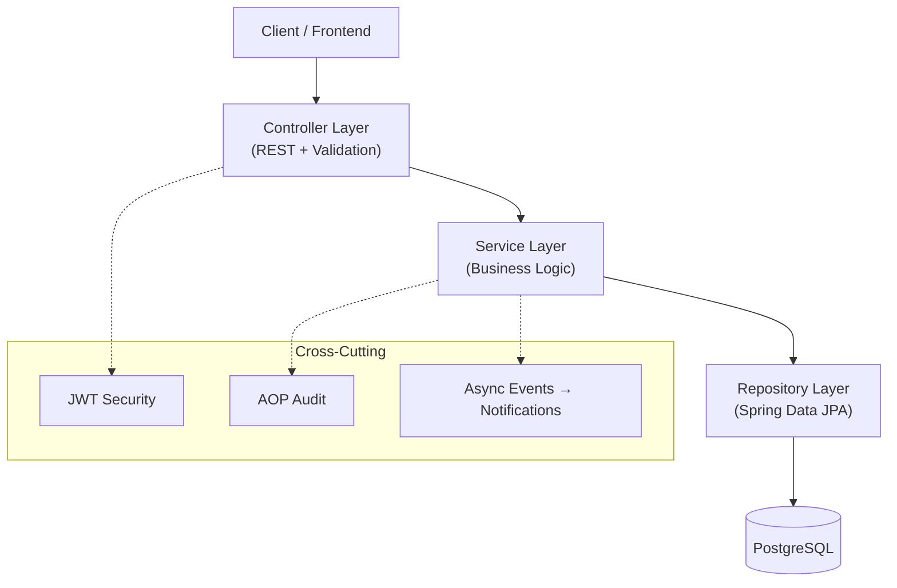

# TaskFlow Pro

> **Enterprise-grade Project & Task Management REST API** — built with Java 21, Spring Boot 3, PostgreSQL, and production-ready patterns.

[](https://openjdk.org/)
[](https://spring.io/projects/spring-boot)
[](https://www.postgresql.org/)
[](https://www.docker.com/)
[](LICENSE)

---

## Table of Contents

- [Overview](#overview)
- [Key Features](#key-features)
- [Architecture](#architecture)
- [Tech Stack](#tech-stack)
- [Project Structure](#project-structure)
- [Getting Started](#getting-started)
- [Environment Variables](#environment-variables)
- [API Documentation](#api-documentation)
- [API Reference](#api-reference)
- [Example Requests](#example-requests)
- [Security Model](#security-model)
- [Database Migrations](#database-migrations)
- [Testing](#testing)
- [Production Deployment](#production-deployment)
- [Design Decisions](#design-decisions)
- [License](#license)

---

## Overview

**TaskFlow Pro** is a full-featured backend API for modern team collaboration. It enables organizations to manage projects, assign and track tasks, collaborate through comments, and maintain a complete audit trail of every critical action.

The system is designed for **real-world production use**: stateless JWT security, role-based access control, Liquibase-managed schema migrations, async notifications, AOP audit logging, and Testcontainers-backed integration tests.

---

## Key Features

| Area | Capabilities |
|------|-------------|
| **Authentication** | JWT register/login, BCrypt password hashing, stateless sessions |
| **Authorization** | Global roles (`ADMIN`, `MANAGER`, `USER`) + project roles (`OWNER`, `MANAGER`, `MEMBER`, `VIEWER`) |
| **Projects** | CRUD, team membership, owner/manager permissions, pagination |
| **Tasks** | CRUD, assignment, status & priority, due dates, dynamic filtering |
| **Task History** | Automatic change tracking on every field update |
| **Comments** | Threaded task discussions with author attribution |
| **Notifications** | Async in-app alerts via Spring Events (`TASK_ASSIGNED`, `STATUS_CHANGED`, etc.) |
| **Audit Logs** | AOP-based action logging with IP address and JSON payload |
| **User Management** | Admin endpoints + self-service profile updates |
| **API Docs** | Interactive Swagger UI (OpenAPI 3) |

---

## Architecture

TaskFlow Pro follows a **layered clean architecture** with clear separation of concerns:



| Layer | Responsibility |
|-------|----------------|
| **Controller** | HTTP mapping, input validation, OpenAPI annotations |
| **Service** | Business rules, transactions, authorization checks |
| **Repository** | Data access, JPA Specifications, pagination |
| **Entity** | Domain model mapped to PostgreSQL via Hibernate |

---

## Tech Stack

| Technology | Version | Purpose |
|------------|---------|---------|
| Java | 21 | Language & runtime |
| Spring Boot | 3.2.x | Application framework |
| Spring Security | 6 | Authentication & authorization |
| Spring Data JPA | 3.2.x | ORM & repositories |
| Hibernate | 6.x | JPA implementation |
| PostgreSQL | 16 | Relational database |
| Liquibase | 4.x | Versioned schema migrations |
| MapStruct | 1.5.5 | Compile-time DTO mapping |
| JJWT | 0.12.3 | JWT creation & validation |
| Springdoc OpenAPI | 2.3.0 | Swagger UI / API docs |
| Lombok | — | Boilerplate reduction |
| Testcontainers | 1.19.x | Integration test database |
| Docker Compose | 3.9 | Container orchestration |
| Maven | 3.9+ | Build & dependency management |

---

## Project Structure

```
taskflow-pro/
├── src/main/java/com/taskflow/
│   ├── config/           # Security, JWT, OpenAPI, Async
│   ├── controller/       # REST endpoints
│   ├── service/          # Business logic
│   ├── repository/       # Data access + Specifications
│   ├── domain/
│   │   ├── entity/       # JPA entities
│   │   └── enums/        # Domain enumerations
│   ├── dto/              # Request/response records
│   ├── mapper/           # MapStruct mappers
│   ├── security/         # JWT filter, UserDetails, SecurityUtils
│   ├── event/            # Spring Events + async listeners
│   ├── aspect/           # AOP audit logging
│   ├── annotation/       # @Auditable
│   └── exception/        # Global exception handling
├── src/main/resources/
│   ├── application.yml
│   ├── application-dev.yml
│   ├── application-prod.yml
│   └── db/migration/     # Liquibase SQL (V1–V4)
├── src/test/java/        # Unit + integration tests
├── Dockerfile
├── docker-compose.yml
├── docker-compose.prod.yml
└── pom.xml
```

---

## Getting Started

### Prerequisites

- **Java 21+**
- **Maven 3.9+**
- **Docker & Docker Compose** (recommended)

### Option 1 — Docker (Recommended)

```bash
# 1. Clone the repository
git clone https://github.com/YOUR_USERNAME/taskflow-pro.git
cd taskflow-pro

# 2. Configure environment
cp .env.example .env
# Edit .env and set a strong JWT_SECRET (256-bit minimum)

# 3. Start everything
docker compose up --build
```

The API will be available at **http://localhost:8080**

> **Note:** When running via Docker Compose, set `DB_URL=jdbc:postgresql://postgres:5432/taskflow` in your `.env` file (the hostname `postgres` refers to the Docker service, not `localhost`).

### Option 2 — Local Development

```bash
# Start PostgreSQL only
docker compose up postgres -d

# Configure environment
cp .env.example .env

# Run the application
mvn spring-boot:run
```

### Verify Installation

| Resource | URL |
|----------|-----|
| API Base | http://localhost:8080 |
| Swagger UI | http://localhost:8080/swagger-ui.html |
| OpenAPI JSON | http://localhost:8080/v3/api-docs |

---

## Environment Variables

| Variable | Description | Default |
|----------|-------------|---------|
| `DB_URL` | JDBC connection URL | `jdbc:postgresql://localhost:5432/taskflow` |
| `DB_USERNAME` | Database username | `taskflow` |
| `DB_PASSWORD` | Database password | `taskflow` |
| `JWT_SECRET` | HMAC signing key (min. 256 bits) | *(must change in production)* |
| `JWT_EXPIRATION_MS` | Token lifetime in milliseconds | `86400000` (24 hours) |

Copy `.env.example` to `.env` and update values before deploying.

---

## API Documentation

Interactive API documentation is available via **Swagger UI** after starting the application:

```
http://localhost:8080/swagger-ui.html
```

All secured endpoints support **Bearer JWT** authentication. Use the **Authorize** button in Swagger UI to paste your token.

---

## API Reference

### Authentication

| Method | Endpoint | Access | Description |
|--------|----------|--------|-------------|
| `POST` | `/api/auth/register` | Public | Register a new user |
| `POST` | `/api/auth/login` | Public | Login and receive JWT |

### Users

| Method | Endpoint | Access | Description |
|--------|----------|--------|-------------|
| `GET` | `/api/users/me` | Authenticated | Get current user profile |
| `PUT` | `/api/users/me` | Authenticated | Update current user profile |
| `GET` | `/api/users` | ADMIN | List all users (paginated) |
| `GET` | `/api/users/{id}` | ADMIN | Get user by ID |
| `PATCH` | `/api/users/{id}/role` | ADMIN | Update user role |
| `PATCH` | `/api/users/{id}/activate` | ADMIN | Activate user account |
| `PATCH` | `/api/users/{id}/deactivate` | ADMIN | Deactivate user account |

### Projects

| Method | Endpoint | Access | Description |
|--------|----------|--------|-------------|
| `POST` | `/api/projects` | MANAGER / ADMIN | Create project |
| `GET` | `/api/projects` | Authenticated | List my projects (paginated) |
| `GET` | `/api/projects/{id}` | Member | Get project details |
| `PUT` | `/api/projects/{id}` | OWNER / MANAGER | Update project |
| `DELETE` | `/api/projects/{id}` | OWNER | Delete project |
| `GET` | `/api/projects/{id}/members` | Member | List project members |
| `POST` | `/api/projects/{id}/members` | OWNER / MANAGER | Add member |
| `DELETE` | `/api/projects/{id}/members/{userId}` | OWNER / MANAGER | Remove member |

### Tasks

| Method | Endpoint | Access | Description |
|--------|----------|--------|-------------|
| `POST` | `/api/tasks` | Member | Create task |
| `GET` | `/api/tasks/project/{projectId}` | Member | List tasks with filters |
| `GET` | `/api/tasks/{id}` | Member | Get task details |
| `PUT` | `/api/tasks/{id}` | Member | Update task (auto history) |
| `DELETE` | `/api/tasks/{id}` | Reporter / OWNER / MANAGER | Delete task |
| `POST` | `/api/tasks/{id}/comments` | Member | Add comment |
| `GET` | `/api/tasks/{id}/comments` | Member | List comments |
| `GET` | `/api/tasks/{id}/history` | Member | Get change history |

**Task filters** (query params on list endpoint): `status`, `priority`, `assigneeId`, `dueDateBefore`, `dueDateAfter`, `search`, `page`, `size`, `sort`

### Notifications

| Method | Endpoint | Access | Description |
|--------|----------|--------|-------------|
| `GET` | `/api/notifications` | Authenticated | List my notifications |
| `GET` | `/api/notifications/unread-count` | Authenticated | Count unread |
| `PATCH` | `/api/notifications/{id}/read` | Authenticated | Mark one as read |
| `PATCH` | `/api/notifications/read-all` | Authenticated | Mark all as read |

### Audit (Admin)

| Method | Endpoint | Access | Description |
|--------|----------|--------|-------------|
| `GET` | `/api/audit` | ADMIN | List all audit logs |
| `GET` | `/api/audit/user/{userId}` | ADMIN | Logs by user |
| `GET` | `/api/audit/entity/{type}/{id}` | ADMIN | Logs by entity |

---

## Example Requests

### Register

```bash
curl -X POST http://localhost:8080/api/auth/register \
  -H "Content-Type: application/json" \
  -d '{
    "email": "john@taskflow.com",
    "username": "johndoe",
    "password": "password123",
    "fullName": "John Doe"
  }'
```

### Login

```bash
curl -X POST http://localhost:8080/api/auth/login \
  -H "Content-Type: application/json" \
  -d '{
    "email": "john@taskflow.com",
    "password": "password123"
  }'
```

### Create a Project (requires MANAGER or ADMIN role)

```bash
curl -X POST http://localhost:8080/api/projects \
  -H "Authorization: Bearer YOUR_JWT_TOKEN" \
  -H "Content-Type: application/json" \
  -d '{
    "name": "Website Redesign",
    "description": "Q3 redesign initiative"
  }'
```

### Create a Task

```bash
curl -X POST http://localhost:8080/api/tasks \
  -H "Authorization: Bearer YOUR_JWT_TOKEN" \
  -H "Content-Type: application/json" \
  -d '{
    "title": "Design homepage mockup",
    "priority": "HIGH",
    "projectId": "PROJECT_UUID_HERE"
  }'
```

### Filter Tasks

```bash
curl "http://localhost:8080/api/tasks/project/PROJECT_UUID?status=TODO&priority=HIGH&page=0&size=20" \
  -H "Authorization: Bearer YOUR_JWT_TOKEN"
```

### Update Task Status

```bash
curl -X PUT http://localhost:8080/api/tasks/TASK_UUID \
  -H "Authorization: Bearer YOUR_JWT_TOKEN" \
  -H "Content-Type: application/json" \
  -d '{ "status": "IN_PROGRESS" }'
```

---

## Security Model

### Authentication Flow

```
Register/Login  →  JWT issued (HMAC-SHA256)  →  Bearer token on every request
```

### Global Roles

| Role | Permissions |
|------|-------------|
| `USER` | Access projects as member; create/update tasks |
| `MANAGER` | Create projects; manage team members |
| `ADMIN` | Full user management; read audit logs |

### Project Roles

| Role | Permissions |
|------|-------------|
| `OWNER` | Full project control; delete project |
| `MANAGER` | Update project; add/remove members |
| `MEMBER` | View project; create and update tasks |
| `VIEWER` | Read-only project access |

---

## Database Migrations

All schema changes are managed by **Liquibase** (Hibernate `ddl-auto: validate` — never auto-creates tables).

| Migration | Description |
|-----------|-------------|
| **V1** | `users`, `roles`, `user_roles` |
| **V2** | Seed roles: `ADMIN`, `MANAGER`, `USER` |
| **V3** | `projects`, `project_members`, `tasks`, `task_comments`, `task_history` |
| **V4** | `notifications`, `audit_logs` |

Migrations run automatically on application startup.

---

## Testing

```bash
# Run all tests
mvn test

# Compile only
mvn clean compile
```

| Type | Location | Stack |
|------|----------|-------|
| **Unit tests** | `src/test/java/com/taskflow/service/` | JUnit 5 + Mockito |
| **Integration tests** | `src/test/java/com/taskflow/controller/` | Spring Boot Test + Testcontainers + MockMvc |

> Integration tests require **Docker** to be running and accessible to Testcontainers. On some Windows setups, tests may be skipped if Docker is not reachable from the JVM.

---

## Production Deployment

```bash
# 1. Build the Docker image
docker build -t taskflow-pro:latest .

# 2. Create production .env with:
#    DB_NAME, DB_USERNAME, DB_PASSWORD, JWT_SECRET, JWT_EXPIRATION_MS

# 3. Deploy
docker compose -f docker-compose.prod.yml up -d
```

Production profile (`application-prod.yml`) enables:
- Connection pooling (HikariCP)
- Reduced logging verbosity
- File-based log output at `/app/logs/taskflow.log`

---

## Design Decisions

| Decision | Rationale |
|----------|-----------|
| **UUID primary keys** | Prevents ID enumeration; safe for distributed systems |
| **Liquibase over ddl-auto** | Versioned, reviewable migrations; Hibernate only validates |
| **MapStruct over ModelMapper** | Compile-time safety, no runtime reflection overhead |
| **Testcontainers over H2** | Real PostgreSQL in tests catches dialect-specific bugs |
| **Spring Events for notifications** | Decoupled, async delivery without blocking API responses |
| **AOP for audit logging** | Declarative `@Auditable` — failures never break business flow |
| **JWT stateless auth** | Horizontally scalable; no server-side session store |

---

## License

This project is licensed under the **MIT License** — see the [LICENSE](LICENSE) file for details.

---

<p align="center">
  Built with ☕ Java 21 & Spring Boot 3 &nbsp;|&nbsp; TaskFlow Pro &copy; 2026
</p>
